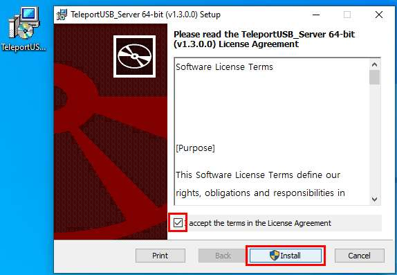
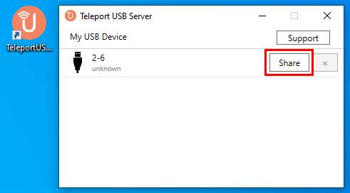
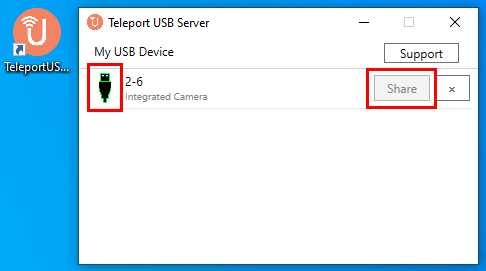
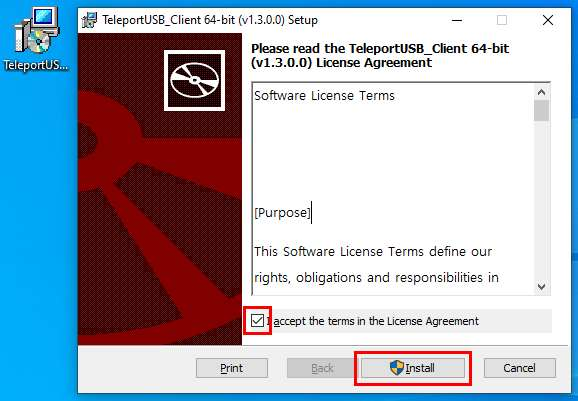
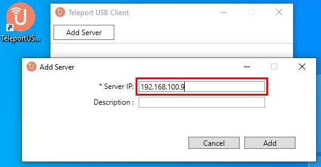
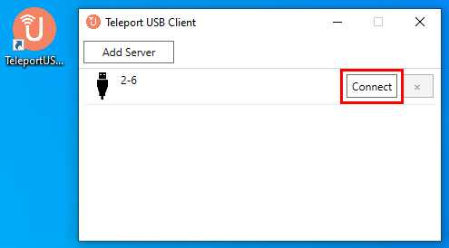
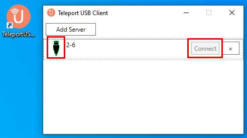
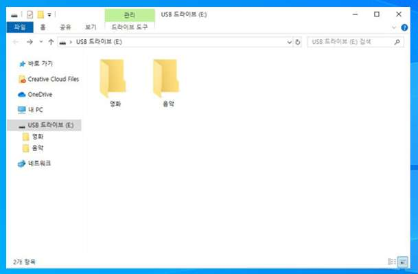

<div align="center">

# 🔌 Teleport USB

**USB 장치를 네트워크를 통해 원격으로 공유하는 Virtual USB Network 솔루션**

[](https://github.com/devguru-corp/TeleportUSB/releases)
[](https://github.com/devguru-corp/TeleportUSB)
[](https://github.com/devguru-corp/TeleportUSB)
[](https://hits.seeyoufarm.com)

<br>

[**한국어**](./README.md) | [**English**](./README_EN.md)

<br>


<br><br>

```
┌──────────────┐                              ┌──────────────┐
│  Server PC   │         네트워크 공유         │  Client PC   │
│              │  ◀━━━━━━━━━━━━━━━━━━━━━━━━▶  │              │
│  🔌 USB 연결  │         TCP/IP 통신           │  💻 원격 사용  │
└──────────────┘                              └──────────────┘
```

</div>

---

## 📑 목차

<details>
<summary><b>클릭하여 목차 펼치기</b></summary>

- [📦 설치 파일 다운로드](#-설치-파일-다운로드)
- [⚙️ 시스템 요구사항](#️-시스템-요구사항)
- [🖥️ Server 설치](#️-server-설치-usb-장치를-연결할-pc)
- [💻 Client 설치](#-client-설치-usb-장치를-사용할-pc)
- [✅ 사용 확인](#-사용-확인)
- [🔧 트러블슈팅](#-트러블슈팅)
- [📌 참고사항](#-참고사항)

</details>

---

## 📦 설치 파일 다운로드

| 파일 | 설치 대상 | 다운로드 |
|:----:|:--------:|:-------:|
| **Server** Installer | USB 장치가 연결된 PC | [⬇️ 다운로드](./TeleportUSB_server_installer_64bit.msi) |
| **Client** Installer | USB 장치를 원격 사용할 PC | [⬇️ 다운로드](./TeleportUSB_client_installer_64bit.msi) |

---

## ⚙️ 시스템 요구사항

> Server PC와 Client PC **모두** 아래 사양을 충족해야 합니다.

| 항목 | 최소 사양 |
|:----:|:--------:|
| **OS** | Windows 10 64bit 이상 |
| **Processor** | Intel i3 Dual Core 이상 |
| **RAM** | 4GB 이상 |
| **권한** | 관리자 권한 (MSI 설치 시 필요) |
| **네트워크** | Server ↔ Client 동일 네트워크(서브넷) |

### 🌐 Server PC의 IP 주소 확인 방법

Client 설치 시 Server IP가 필요합니다. **Server PC에서** 미리 확인해 두세요.

<details>
<summary><b>📋 IP 확인 방법 보기</b></summary>

<br>

**방법 1 — 명령 프롬프트 (cmd)**

```cmd
ipconfig
```

출력에서 **IPv4 주소**를 확인합니다:

```
이더넷 어댑터:
   IPv4 주소 . . . . . . . . : 192.168.100.9    ← 이 값을 메모
   서브넷 마스크 . . . . . . : 255.255.255.0
   기본 게이트웨이 . . . . . : 192.168.100.1
```

**방법 2 — PowerShell**

```powershell
(Get-NetIPAddress -AddressFamily IPv4 | Where-Object { $_.InterfaceAlias -notlike "*Loopback*" }).IPAddress
```

</details>

---

## 🖥️ Server 설치 (USB 장치를 연결할 PC)

> **📍 이 섹션은 USB 장치가 물리적으로 연결된 PC에서 진행합니다.**

### Step 1 — 설치 프로그램 실행

1. `TeleportUSB_server_installer_64bit.msi`를 **더블 클릭**
2. UAC 팝업 → **`예`** 클릭
3. **`accept the terms in the License Agreement`** 체크
4. **`Install`** 클릭

<div align="center">

<br><em>라이선스 동의 체크 후 Install 클릭</em>
</div>

<br>

5. 설치 완료 → **`Finish`** 클릭

### Step 2 — 프로그램 실행

1. 바탕화면 또는 시작 메뉴에서 **`Teleport USB Server`** 실행
2. 트레이 아이콘(화면 우측 하단)에 Teleport USB 아이콘이 나타나면 정상

### Step 3 — USB 장치 공유

1. 공유할 USB 장치를 Server PC에 연결
2. 프로그램 창에서 장치가 표시되면 **`Share`** 클릭

<div align="center">

<br><em>장치 목록에서 Share 버튼 클릭</em>
</div>

<br>

3. ✅ **공유 성공 확인:**

<div align="center">

<br><em>녹색 테두리 = 공유 완료</em>
</div>

| 확인 포인트 | 상태 |
|:-----------:|:----:|
| USB 아이콘 테두리 | 🟢 녹색 |
| Share 버튼 | 비활성화(회색) |
| 장치 이름 | 표시됨 |

> 💡 **공유 해제:** 장치 옆의 **`x`** 버튼 클릭

---

## 💻 Client 설치 (USB 장치를 사용할 PC)

> **📍 이 섹션은 USB 장치를 원격으로 사용할 PC에서 진행합니다.**

### Step 1 — 설치 프로그램 실행

1. `TeleportUSB_client_installer_64bit.msi`를 **더블 클릭**
2. UAC 팝업 → **`예`** 클릭
3. **`accept the terms in the License Agreement`** 체크
4. **`Install`** 클릭

<div align="center">

<br><em>라이선스 동의 체크 후 Install 클릭</em>
</div>

<br>

5. 설치 완료 → **`Finish`** 클릭

### Step 2 — 프로그램 실행

1. 바탕화면 또는 시작 메뉴에서 **`Teleport USB Client`** 실행

### Step 3 — Server 연결

1. 상단의 **`Add Server`** 클릭
2. **Server IP** 입력 (예: `192.168.100.9`) → **`Add`** 클릭

<div align="center">

<br><em>Server PC의 IP 주소 입력 후 Add 클릭</em>
</div>

<br>

3. Server에서 공유된 장치가 **자동 검색**됨 → **`Connect`** 클릭

<div align="center">

<br><em>검색된 장치에서 Connect 클릭</em>
</div>

<br>

4. ✅ **연결 성공 확인:**

<div align="center">

<br><em>녹색 테두리 = 연결 완료</em>
</div>

| 확인 포인트 | 상태 |
|:-----------:|:----:|
| USB 아이콘 테두리 | 🟢 녹색 |
| Connect 버튼 | 비활성화(회색) |

> 💡 **연결 해제:** 장치 옆의 **`x`** 버튼 클릭

---

## ✅ 사용 확인

연결이 완료되면 Client PC에서 USB 장치를 **로컬에 직접 연결한 것과 동일하게** 사용할 수 있습니다.

<div align="center">

<br><em>Client PC 파일 탐색기에서 USB 드라이브가 정상적으로 표시됨</em>
</div>

<br>

### ✔️ 정상 동작 체크리스트

| # | 확인 항목 | 예상 결과 |
|:-:|:---------|:---------|
| 1 | Server에서 USB 아이콘 녹색 테두리 | ✅ 장치 공유 정상 |
| 2 | Client에서 `Add Server` 후 장치 검색 | ✅ 네트워크 연결 정상 |
| 3 | Client에서 USB 아이콘 녹색 테두리 | ✅ 장치 연결 정상 |
| 4 | Client PC 파일 탐색기에 USB 드라이브 표시 | ✅ 사용 준비 완료 |
| 5 | 파일 읽기/쓰기/삭제 동작 | ✅ 정상 작동 |

---

## 🔧 트러블슈팅

<details>
<summary><b>❌ 장치가 검색되지 않아요</b></summary>

<br>

| 원인 | 해결 방법 |
|:-----|:---------|
| Server에서 장치를 공유하지 않음 | Server 프로그램에서 `Share` 버튼 클릭 확인 |
| IP 주소 오류 | Server PC에서 `ipconfig`로 IP 재확인 |
| 네트워크 분리 | 두 PC가 같은 네트워크/서브넷에 있는지 확인 |
| 방화벽 차단 | 아래 **방화벽 허용 방법** 참고 |

</details>

<details>
<summary><b>🔥 방화벽 허용 방법 (Server PC)</b></summary>

<br>

1. Windows 검색 → **`Windows Defender 방화벽`** 열기
2. 좌측 **`앱 또는 기능을 Windows Defender 방화벽을 통해 허용`** 클릭
3. **`설정 변경`** → **`다른 앱 허용`** 클릭
4. Teleport USB Server 실행 파일 찾아 추가
5. **개인** 및 **공용** 네트워크 모두 체크 → **`확인`**

또는 PowerShell(관리자)에서:

```powershell
New-NetFirewallRule -DisplayName "Teleport USB Server" -Direction Inbound -Action Allow -Program "C:\Program Files\DEVGURU\TeleportUSB\TeleportUSB_Server.exe"
```

</details>

<details>
<summary><b>⚠️ 연결 후 장치가 동작하지 않아요</b></summary>

<br>

| 원인 | 해결 방법 |
|:-----|:---------|
| 드라이버 미설치 | Client PC에 해당 USB 장치의 드라이버 설치 |
| 장치 사용 충돌 | Server PC에서 해당 장치를 사용 중인 프로그램 종료 |
| 프로그램 미실행 | Server/Client 양쪽 모두 프로그램 실행 중인지 확인 |
| 네트워크 불안정 | 유선 LAN 연결 권장, Wi-Fi 사용 시 신호 확인 |

</details>

---

## 📌 참고사항

| 항목 | 내용 |
|:----:|:-----|
| **버전 호환** | Server와 Client 프로그램 버전이 동일해야 합니다 (현재 v1.3.0.0) |
| **동시 연결** | 하나의 USB 장치는 한 번에 **하나의 Client**만 연결 가능 |
| **연결 유지** | Server PC 종료 또는 USB 분리 시 Client 연결도 자동 해제 |
| **프로그램 제거** | `설정` → `앱` → `Teleport USB` 검색 → `제거` |

---

<div align="center">

**Made by [DEVGURU Corp.](https://www.devguru.co.kr)**

<sub>Copyright &copy; 2026 DEVGURU. All rights reserved.</sub>

</div>
